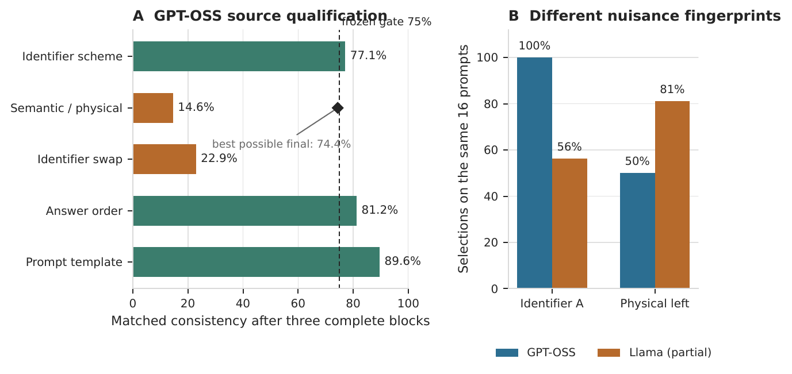

# PREF-CAL v1.4

**Different Models, Different Nuisances: Counterfactual Auditing of AI Preference Elicitation**

> **Research status:** Apart Digital Minds Research Sprint, August 2026  
> **Evidence status:** GPT-OSS confirmatory prospective stop; Llama interrupted/exploratory  
> **Headline numbers reproducible without API access:** Yes  
> **Protocol version:** PREF-CAL v1.4

PREF-CAL is a prospective, gate-driven audit for a construct-validity question: when a language model repeatedly selects one task, is the semantic task actually controlling the answer, or is an arbitrary interface feature doing the work?

The repository contains the frozen designs, raw provider logs, prospective stop verdict, report source, and regression tests needed to reconstruct every headline quantity **offline**. A failed qualification gate is a valid scientific result; the protocol does not force a preference interpretation when the source measurement fails.



## Headline result

The frozen GPT-OSS-120B run completed 52 controls and three complete 32-row source blocks. Semantic/physical-swap consistency was only `7/48`. Even if every remaining planned contrast had been invariant, the final rate could have reached at most:

```text
(7 observed matches + 112 unobserved contrasts) / 160 planned contrasts
= 119 / 160
= 74.375%
```

That is below the frozen `75%` source gate. The prospective verdict was therefore:

```text
STOP_PROSPECTIVE_DETERMINISTIC_FUTILITY
source_qualified = false
transport_run = false
```

The separately interrupted Llama-3.3-70B archive is **not** a replication. It does preserve the exact same 16-condition `M2P00 / A-B` slice:

| Diagnostic on the same prompts | GPT-OSS | Llama partial |
| --- | ---: | ---: |
| Selected identifier A | 16/16 | 9/16 |
| Selected physical-left option | 8/16 | 13/16 |
| Semantic/physical consistency | 0/8 | 3/8 |
| Identifier-reassignment consistency | 0/8 | 5/8 |
| Answer-order consistency | 8/8 | 5/8 |
| Template consistency | 8/8 | 7/8 |

The result is not “GPT-OSS prefers A” or “Llama prefers the left task.” The observed regularities did not earn preference semantics under the frozen qualification rule.

## Verify the published evidence offline

```bash
python -m venv .venv
source .venv/bin/activate          # Windows: .venv\Scripts\activate
python -m pip install -e ".[dev]"

python scripts/regenerate_manifest.py --check
python scripts/verify_release.py
python scripts/reproduce_report_numbers.py --check
python -m unittest discover -s tests -p 'test_release_*.py' -v
pytest -q
```

These commands do **not** call a model API. Together they check byte-level repository integrity, reconstruct the M2 factor contrasts and deterministic futility bound from the archived logs, verify the matched slice, check the machine-readable claim contract against the frozen configuration, and compare the reconstruction with the saved report-number snapshot.

To deliberately refresh the derived snapshot after a scientifically justified code change:

```bash
python scripts/reproduce_report_numbers.py
python scripts/regenerate_manifest.py
```

## Executable claim contract

[`CLAIM_CONTRACT.json`](CLAIM_CONTRACT.json) records the inference boundary in machine-readable form. In particular:

- source evidence is eligible for transport only after the frozen control and M2 invariance gates qualify;
- deterministic futility can terminate the source measurement when the frozen threshold becomes mathematically unreachable;
- source failure withholds M3/M4 and preference semantics;
- failure of this measurement bridge is **not** evidence that subjective preference, sentience, consciousness, welfare, or moral patienthood are absent.

The authoritative scientific specification remains [`FROZEN_PROTOCOL.md`](FROZEN_PROTOCOL.md) and the frozen configuration files. `scripts/verify_release.py` checks that the machine-readable claim contract remains synchronized with those artifacts.

## Run or extend the original protocol

The original staged NVIDIA runner is preserved:

```bash
python scripts/preflight.py \
  --config configs/prefcal_nvidia_gpt_oss.json \
  --model-name nvidia_gpt_oss_120b_v14

python scripts/design.py \
  --config configs/prefcal_nvidia_gpt_oss.json \
  --output-run /path/to/a/fresh/run

python scripts/run_staged.py \
  --config configs/prefcal_nvidia_gpt_oss.json \
  --output-run /path/to/a/fresh/run \
  --model-name nvidia_gpt_oss_120b_v14 \
  --phase all
```

Set `NVIDIA_API_KEY` in the environment or Colab Secrets; never paste it into code. For Llama, use `configs/prefcal_nvidia_llama.json` and a separate run directory.

The Colab version is [`PREF_CAL_v1_4_NVIDIA_Colab.ipynb`](PREF_CAL_v1_4_NVIDIA_Colab.ipynb). Do not override a scientific stop simply to spend more compute.

## Repository map

```text
CLAIM_CONTRACT.json   machine-readable inference/abstention boundary
FROZEN_PROTOCOL.md   authoritative prospective scientific protocol
prefcal/              design, runner, parser, statistics, source gate
scripts/              runners, evidence auditing, manifest and release tools
configs/              frozen GPT-OSS, Llama, and mock configurations
tests/                protocol tests plus evidence regression tests
artifacts/gpt_oss/    complete stopped GPT-OSS evidence package
artifacts/llama_partial/ interrupted Llama evidence package
artifacts/reproduced/ deterministic derived report-number snapshot
reports/              final report, editable LaTeX source, and figure
docs/                 provenance and licensing notes
```

## Release builders

`scripts/build_release.py` is the **historical** builder for the frozen 2026-08-15 NVIDIA source package and is retained for provenance.

For the current public repository archive use:

```bash
python scripts/regenerate_manifest.py
python scripts/build_github_release.py
```

The public builder refuses to proceed if the manifest, evidence reconstruction, or report-number snapshot is stale.

## Claim boundary

PREF-CAL tests whether a revealed task-selection direction is identified against frozen interface nuisances and, only after qualification, transports to held-out action and allocation interfaces.

It does not establish subjective preference, consciousness, welfare, moral patienthood, a privileged model/persona ontology, or experienced cost. Gate failure also does not prove their absence; it falsifies the tested bridge from these outputs to that interpretation.

## Report and citation

The report is [`reports/PREF_CAL_Digital_Minds_Submission.pdf`](reports/PREF_CAL_Digital_Minds_Submission.pdf); editable LaTeX and bibliography are under `reports/source/`. Citation metadata are provided in [`CITATION.cff`](CITATION.cff).

## Licensing status

No repository-wide software license has been selected in this release. See [`docs/LICENSING.md`](docs/LICENSING.md). Third-party font assets retain their own license files under `reports/source/fonts/`.
